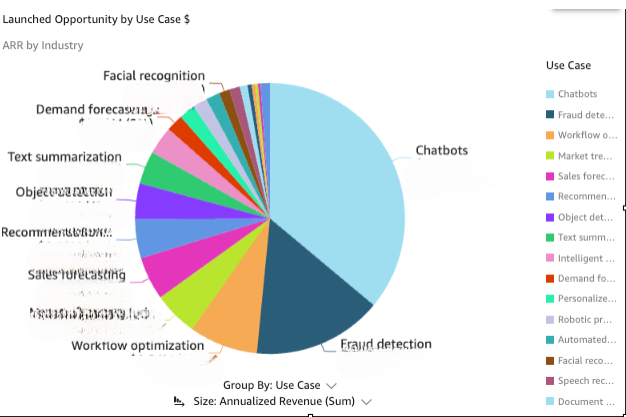
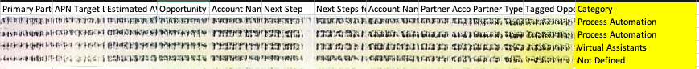

# Sales Opportunity Classifier with Amazon Bedrock

This project implements an automated pipeline for processing Salesforce opportunties using Amazon Bedrock. It uses AWS CDK for infrastructure as code, allowing easy deployment and management of the required AWS resources.

## Solution Overview

This solution provides an automated tool for Salesforce opportunities data analysis using AWS services. It allows sales teams to upload Salesforce opportunities in the form of an Excel spreadsheet, which is then analyzed to categorize each opportunity based on broad use cases. The tool leverages Amazon Bedrock for AI-based categorization and is designed to help sales teams better understand trends in opportunity generation and partner competency. This tool enables sales teams to gain a deeper insight into their opportunities and create meaningful dashboards to make effective business decisions moving forward.



Key services of the solution include:

- **S3 for Storage**: Users upload an Excel spreadsheet of Salesforce opportunities to an S3 bucket. This spreadsheet contains data about different sales opportunities.

- **AWS SageMaker Notebook Instance**: A SageMaker notebook instance is triggered upon data upload. The notebook processes the Excel file, extracting relevant information about each opportunity.

- **Amazon Bedrock for AI Categorization**: The tool uses Amazon Bedrock to analyze each opportunity based on the descriptions provided in the spreadsheet. The Bedrock-powered model (Claude 3) determines which broad categories (e.g., Generative AI use cases) best fit each opportunity.

- **Opportunity Categorization and Insights**: The processed data is returned to the S3 bucket with categorizations that help the sales team understand:
  - Which specific use cases (e.g., Generative AI, Process Automation) are generating the most revenue.
  - Which partners are most competent in implementing certain use cases.
  
- **Lambda Function for Automation**: A Lambda function is automatically triggered when new data is uploaded to the S3 bucket. It starts the SageMaker notebook instance and processes the data.


This tool provides valuable insights into opportunity trends and partner capabilities, empowering sales teams to make data-driven decisions and focus on high-revenue use cases.


## Prerequisites

- AWS Account
- AWS CLI configured with appropriate permissions
- Node.js and npm installed
- Python 3.9 or later
- AWS CDK CLI installed (`npm install -g aws-cdk`)
- Have Claude 3 Sonnet model enabled on Amazon Bedrock

## Setup and Deployment

1. Clone this repository:
```
git clone https://github.com/aws-samples/Sales-Opportunity-Classifier-with-Amazon-Bedrock
```

2. Install the required dependencies:
```
pip install -r requirements.txt
```

3. Configure the CDK stack in sagemaker_s3_pipeline_stack.py only if necessary. Update any parameters or configurations as needed.

4. Deploy the CDK stack:
```
cdk deploy --parameters CustomList="value1,value2,value3"
```

Replace "value1,value2,value3" with your desired category values. e.g cdk deploy --parameters CustomList="Image Recognition,Process Automation,Virtual Assistant"

Note: If an opportunity do not fall under any of the categories defined, it will be labelled as "Not Defined".

5. Once deployed, the S3 bucket name will be available in your SageMaker notebook. You can access it by reading the /home/ec2-user/SageMaker/bucket_name.txt file.


## Usage
1. Upload your SFDC data (in .xlsx format) to the created S3 bucket.
2. The Lambda function will automatically trigger and start the SageMaker notebook instance if it's not already running.
3. The SageMaker notebook will process the data. You can monitor the progress in the SageMaker console.
4. Results will be saved back to the S3 bucket, with each opportunity tagged with their respective category.

5. The notebook instance will automatically shut down after 10 minutes of inactivity.

## Cleanup
``` cdk destroy ```

## Contributions 
Contributions are welcome! Please feel free to submit a Pull Request.

## License
This project is licensed under the MIT License - see the LICENSE file for details.
